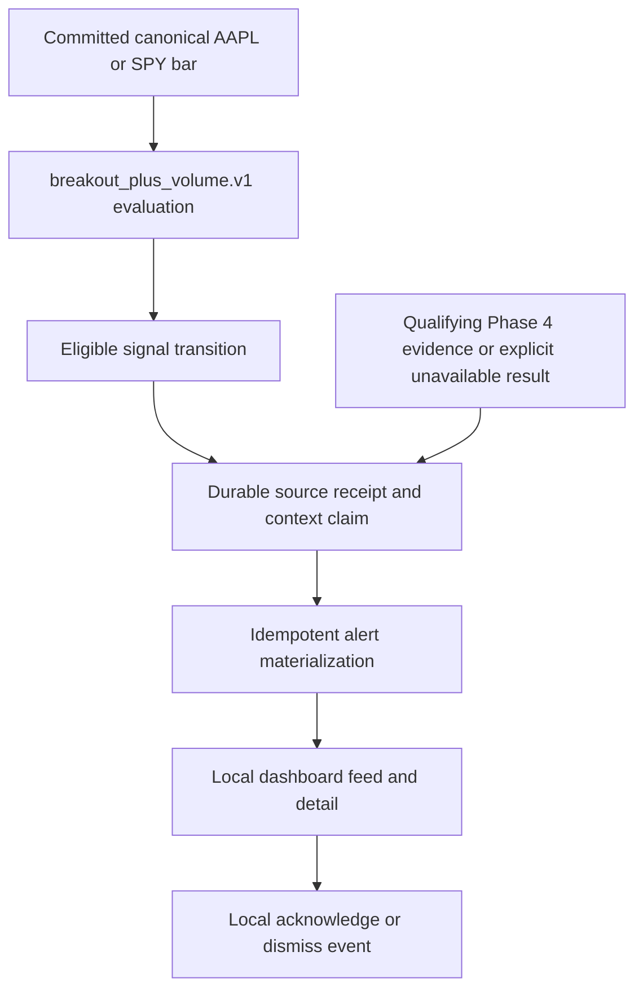

# Daily Trader

Daily Trader is a real-time portfolio monitoring and market decision-support application. It is intended to help an individual investor understand portfolio exposure, detect meaningful market trends, receive explainable alerts, and prepare trades for review.

The project begins as a monitoring and paper-trading system. Live automated execution is explicitly out of scope until the system has passed historical replay, out-of-sample testing, paper trading, shadow operation, and a controlled live rollout.

> [!WARNING]
> Daily Trader is experimental software, not financial advice. Trading involves risk. Do not connect it to a live brokerage account until its behavior and risk controls have been independently reviewed and validated.

## Current implementation

Daily Trader is an npm-workspace TypeScript monorepo running on Node.js 22. Phase 1 established the framework shells, strict domain/configuration/observability packages, local PostgreSQL/TimescaleDB and Redis services, deterministic tests, and CI gates. Phase 2 builds directly on that foundation with a provider-neutral market-data package, an Alpaca adapter, bounded stream recovery, Redis Stream delivery, TimescaleDB persistence, portable replay, and truthful terminal status.

Phase 3 adds the provider-independent `@daily-trader/signals` package, the dedicated PostgreSQL-backed signals worker, exact bounded decimal arithmetic, one versioned breakout-plus-volume observation, append-only evaluation evidence, a durable canonical-revision journal and writer-capability cutover handshake, deterministic signal replay, and terminal signal status. It consumes Phase 2's committed canonical AAPL/SPY bars; it does not connect directly to Alpaca or treat Redis as the durability authority for signal work.

Phase 4 adds a separate GET-only Alpaca paper-broker boundary, the provider-independent `@daily-trader/portfolio` package, append-only complete synchronization cycles, fenced worker ownership, exact broker-mark projections, projection-integrity reconciliation, a local read-only API, and the first paper-portfolio dashboard. Account, position, observed-order, and fill data are observations only; they never become an order intent or execution capability.

The implemented market-data scope is deliberately narrow: provider-supplied one-minute bars for AAPL at `XNAS` and SPY at `ARCX`, during the regular US-equities core session only. Alpaca IEX is real-time single-exchange data with zero configured delay; it is not a consolidated market feed. Session decisions use the accepted embedded 2026-2028 NYSE calendar snapshot and become `unknown` outside that coverage.

Market data, signal monitoring, and paper-portfolio synchronization are all disabled by default. Signal monitoring has one explicit `monitor` mode. Portfolio synchronization has one explicit `paper_read_only` mode, requires separate credentials plus the expected account ID, and is pinned to the paper endpoint. Alerts, risk decisions, order intents, broker mutations, execution, AI research, additional assets, extended hours, and trade-to-bar aggregation are not implemented. Execution remains disabled in every mode.

The credential-gated Phase 2 provider smoke passed on 2026-07-13 after observing normalized AAPL/XNAS and SPY/ARCX bars and shutting down cleanly. That closes the dependency that had kept Phase 3's already-passing technical matrix open; the Phase 2 and Phase 3 exits and their implementation evidence are recorded under `user-stories/notes/`. Phase 4's credential-free technical matrix also passes, while its broker provider smoke remains separate and must not be inferred from fixtures.

Phase 5 is an accepted plan, not implemented behavior. It targets the [`local read-only portfolio-alert MVP`](./docs/planning/mvp-local-read-only-alerts.md): fixed AAPL/SPY `breakout_plus_volume.v1` alerts in the local dashboard, immutable creation-time portfolio context, append-only correction and review history, and no broker mutation or execution. P5-01 through P5-09 remain `Planned`, and P4-11 must close before implementation begins.

### Prerequisites

- Node.js 22.13 or newer, before Node.js 23 (`.nvmrc` pins the validated version)
- npm 11.18.0
- Docker with Compose v2 for local data services

Install exactly the locked dependency graph:

```bash
npm install --global npm@11.18.0
npm ci
```

### Repository structure

```text
apps/api/                  Fastify health and read-only portfolio API
apps/web/                  Next.js paper-portfolio dashboard
workers/market-data/       Alpaca, recovery, delivery, persistence, replay, and status adapters
workers/signals/           Durable canonical-revision processing, replay persistence, and status
workers/portfolio/         GET-only paper sync, persistence, reconciliation, status, and smoke
packages/domain/           Framework-free validated domain primitives
packages/market-data/      Provider-neutral one-minute-bar and session contracts
packages/signals/          Pure exact feature, signal, transition, and replay behavior
packages/portfolio/        Pure observations, exact projections, deltas, and reconciliation
packages/config/           Environment validation and safe diagnostics
packages/observability/    Structured logs, metrics, traces, and redaction
packages/test-utils/       Deterministic test builders
infrastructure/postgres/   Versioned application-owned migrations
infrastructure/            Pinned local Compose services and operating notes
docs/adr/                  Accepted architecture decisions
docs/planning/             Accepted MVP scope and directional post-MVP roadmap
user-stories/              Phase stories and implementation notes
user-stories/epics/        Product epics and delivery boundaries
```

### Quality and build commands

| Command                        | Purpose                                                                |
| ------------------------------ | ---------------------------------------------------------------------- |
| `npm run format`               | Format maintained files.                                               |
| `npm run format:check`         | Verify formatting without writing files.                               |
| `npm run lint`                 | Run type-aware lint rules with zero warnings.                          |
| `npm run lint:fix`             | Apply safe lint fixes, then enforce zero warnings.                     |
| `npm run typecheck`            | Strictly type-check every workspace.                                   |
| `npm test`                     | Run deterministic unit tests once.                                     |
| `npm run test:watch`           | Run unit tests in watch mode.                                          |
| `npm run test:coverage`        | Run tests and write diagnostic V8 coverage.                            |
| `npm run build:config-runtime` | Build configuration and its transitive workspace runtime dependencies. |
| `npm run build`                | Build shared packages, API, web app, and workers.                      |
| `npm run ci`                   | Reproduce the complete CI quality gate locally.                        |

### Market-data commands

| Command                                | Purpose                                                                    |
| -------------------------------------- | -------------------------------------------------------------------------- |
| `npm run db:migrate`                   | Apply or checksum-check versioned PostgreSQL migrations.                   |
| `npm run market-data:recording:verify` | Verify the checked-in synthetic portable recording and checksum.           |
| `npm run market-data:replay`           | Replay the verified fixture through the Redis/persistence boundary.        |
| `npm run market-data:status`           | Render persisted AAPL/SPY bar-close and operational status.                |
| `npm run market-data:provider-smoke`   | Run the separately gated Alpaca AAPL/SPY provider smoke session.           |
| `npm run verify:phase2`                | Run the credential-free Phase 2 fixture, service, replay, and status path. |

The normal CI and fixture/replay paths do not require financial credentials or a provider connection. The portable fixture is synthetic and contains canonical normalized events plus its effective freshness threshold only—no raw provider frames, credentials, account identifiers, or market claims. Service replay uses a checksum-derived target session, a temporary isolated consumer group, and durable session-event links so repeated runs are idempotent without claiming an empty target.

P2-01 through P2-11 are complete. `npm run verify:phase2` passed the integrated Redis/TimescaleDB restart path on a healthy Docker Linux engine, and the separately credential-gated provider smoke passed on 2026-07-13 with both approved symbols. Normal CI still cannot reproduce or imply that external provider result.

### Signal commands

| Command                           | Purpose                                                                                     |
| --------------------------------- | ------------------------------------------------------------------------------------------- |
| `npm run dev:signals`             | Run the dedicated signal worker; disabled mode only freezes/drains captured debt.           |
| `npm run start:signals`           | Build and start the signal worker.                                                          |
| `npm run signal:recording:verify` | Verify the credential-free Phase 3 catalog, schedule, manifest, and output.                 |
| `npm run signal:replay`           | Persist the verified synthetic scenario into its isolated PostgreSQL replay run.            |
| `npm run signal:replay:inspect`   | Inspect one explicitly named replay target without mixing it into live status.              |
| `npm run signal:status`           | Render the selected persisted live signal run and worker health.                            |
| `npm run verify:phase3`           | Run the credential-free technical Phase 3 CI, service, replay, restart, and cleanup matrix. |

The signal worker accepts only committed PostgreSQL canonical revisions. A monitoring run freezes its configuration and semantic versions, owns a durable cursor, and advances that cursor atomically with append-only evidence and run-scoped transitions. Enabling or rolling over live capture audits open paper-writer capability rows before mutating run state. A missing legacy row, retired or incompatible revision/freshness/data-quality capability, or future-dated heartbeat blocks cutover; an exact accepted row whose lease expired is treated as an inactive crashed writer. During capture, the database also fences each canonical commit by the fresh current persistence-writer session while allowing a replacement process to drain pending Redis entries from an expired producer session. A deferred commit-time check prevents a writer blocked on the revision counter from outliving its lease and committing stale work.

The Phase 3 recording and replay core is credential-free and separately versioned from the immutable Phase 2 recording. It verifies catalog, schedule, manifest, and expected-output checksums before persisting an isolated replay target. Pass a target to inspection with `npm run signal:replay:inspect -- <target-id>`; default `signal:status` selects only live-journal state.

`npm run verify:phase3` runs technical credential-free validation: root CI and dependency audit, recording verification, local service health, repeated migrations, two isolated clean replay targets, replay into existing state, an interrupted/restarted replay across a service restart, live canonical-revision processing and restart, replay/live inspection, and bounded cleanup of temporary databases while preserving named volumes. That matrix and the separate Phase 2 provider dependency have passed; P3-01 through P3-09 are complete.

### Portfolio commands

| Command                             | Purpose                                                                                                                |
| ----------------------------------- | ---------------------------------------------------------------------------------------------------------------------- |
| `npm run dev:portfolio`             | Run the dedicated worker; disabled mode opens neither PostgreSQL nor the broker.                                       |
| `npm run start:portfolio`           | Build and start the read-only paper portfolio worker.                                                                  |
| `npm run portfolio:fixture:verify`  | Exercise sanitized account, position, order, and fill fixtures through production adapters.                            |
| `npm run portfolio:fixture:persist` | Persist one sanitized complete cycle into the explicitly configured local verification database.                       |
| `npm run portfolio:status`          | Render the selected complete snapshot and separate sync, reconciliation, and projection state.                         |
| `npm run portfolio:provider-smoke`  | Run the separately gated, four-resource GET-only Alpaca paper-account smoke.                                           |
| `npm run verify:phase4`             | Run credential-free quality, fixture, clean/seeded-upgrade migration, persistence, API, dashboard, and restart checks. |

The worker promotes only a complete account/positions/orders/fills cycle. A partial, malformed, timed-out, account-mismatched, or fenced cycle remains failed evidence and cannot replace the prior current snapshot. Provider source identifiers are fingerprinted before entering application contracts; credentials, raw account IDs, request IDs, and complete provider payloads are not logged or returned by the API. Exact financial values remain strings through `big.js`, PostgreSQL `NUMERIC`, the API, and the dashboard.

Portfolio configuration fixes the approved resources to `account`, `positions`, `orders`, and `fills`. Order pages default to Alpaca's maximum of 500 entries, fill pages default to its maximum of 100 entries, and both can only be reduced through `PORTFOLIO_ORDER_PAGE_SIZE` and `PORTFOLIO_FILL_PAGE_SIZE`. An omitted or blank order/fill item limit derives independently as the smaller of its preferred default (5,000 orders or 1,999 fills) and one less than its configured page-count multiplied by page-size budget. An explicit item limit is never silently clamped and must remain strictly below that budget, leaving room for a short terminal page to prove completeness. Fill coverage means complete pagination for the displayed open provider-created interval: Alpaca's `after` and `until` bounds are both exclusive and apply to activity creation time. The response's separate fill execution time can fall outside those bounds, and the first bounded baseline is not full account history or a gap-free fill ledger. `PORTFOLIO_STATEMENT_TIMEOUT_MS` independently bounds portfolio database statements; it is not derived from the provider request timeout. Unknown `PORTFOLIO_*`, `PAPER_BROKER_*`, and `LIVE_BROKER_*` settings fail before any connection is opened.

### Local services

Copy `.env.example` to `.env` only when local overrides are needed. Never commit `.env`.

```bash
npm run services:up
npm run services:check
npm run db:migrate
npm run services:stop
```

`npm run services:down` removes containers and the Compose network but preserves named volumes. `npm run services:reset` is intentionally destructive: it also deletes local database and Redis volumes.

Migrations are non-destructive and checksum protected: rerunning them checks previously applied content rather than resetting data. They own the Phase 2 market-data schema, Phase 3 signal evidence, and Phase 4 append-only portfolio cycles, observations, projections, reconciliation, and worker status. Run the phase verifier matching the boundary under review. Verification preserves named volumes and stops bounded process resources even when a later step fails.

### Run the process shells

```bash
npm run dev:api     # http://127.0.0.1:3001/health
npm run dev:web     # http://127.0.0.1:3000 (loopback-only)
npm run dev:worker  # safe worker shell; market data remains disabled by default
npm run dev:signals # safe signal shell; signal monitoring remains disabled by default
npm run dev:portfolio # safe read-only shell; portfolio synchronization remains disabled by default
```

All health and status output identifies the environment and keeps order execution disabled. Fixture, replay, migration, and status work never opens a provider or broker connection.

For the optional portfolio provider smoke, use an ignored environment file, set `PORTFOLIO_MODE=paper_read_only`, and provide dedicated `PAPER_BROKER_API_KEY`, `PAPER_BROKER_API_SECRET`, and `PAPER_BROKER_ACCOUNT_ID` values. The endpoint remains fixed to `https://paper-api.alpaca.markets/v2`; the smoke accepts empty collections and makes only account, positions, orders, and fill-activity GET requests. Do not reuse market-data variables, commit the environment file, or report the smoke as passed unless it actually ran.

## Product principles

- **Decision support first.** The initial product informs and alerts; the user remains the decision-maker.
- **Deterministic fast path.** Market signals, portfolio calculations, risk checks, and order validation must use testable deterministic code.
- **AI outside the execution path.** AI may summarize filings and news, explain signals, and help maintain investment theses. It must not submit orders, bypass controls, or silently change strategy rules.
- **Explain every signal.** Alerts must include the observation, threshold, market-data timestamp, portfolio context when available, and invalidation or correction condition when applicable.
- **Fail safely.** Stale, missing, duplicated, or inconsistent data must prevent trade submission rather than trigger a best guess.
- **Preserve an audit trail.** Signals, decisions, order intents, approvals, broker responses, orders, and fills must be traceable.
- **Keep providers replaceable.** Market-data and brokerage integrations belong behind application-owned interfaces.

## Accepted MVP Scope

The first product release targets one local user, one expected Alpaca paper account, fixed AAPL and SPY regular-session one-minute bars, the existing `breakout_plus_volume.v1` observation, and dashboard-only explainable alerts. It aims for seconds-level responsiveness suitable for intraday monitoring, not exchange-colocated high-frequency trading.

The complete scope and exit contract is [`MVP: Local Read-Only Portfolio Alerts`](./docs/planning/mvp-local-read-only-alerts.md). The product epic is [`MVP-01`](./user-stories/epics/mvp-01-local-read-only-portfolio-alerts.md).

### MVP Capabilities

- Synchronize and display one expected Alpaca paper account through the existing four-resource GET-only broker adapter.
- Consume the implemented AAPL/XNAS and SPY/ARCX canonical one-minute bars and `breakout_plus_volume.v1` signal evidence.
- Create one deterministic explainable dashboard alert for an eligible on-time fired occurrence whether the instrument is held or not held.
- Freeze immutable creation-time portfolio context with separate availability, freshness, reconciliation, calculation, membership, and support dimensions; portfolio degradation never hides a valid market alert.
- Preserve append-only alert lineages and revisions through supersession, retraction, and reactivation without resetting local review state.
- Let the local user mark an alert `acknowledged` or `dismissed` without changing signal, portfolio, broker, or execution state.
- Use atomic source-position cutovers so enablement never backfills an upstream signal backlog while captured work survives restart.
- Replay and restart deterministically without losing or duplicating alerts.
- Meet a measured p95 objective at or below five seconds over at least 100 eligible canonical-commit-to-dashboard samples, then complete three distinct full regular core sessions under the accepted operating criteria.

### Not in the MVP

- Configurable symbols, watchlists, additional signals, extended hours, or additional asset classes
- External notifications, snooze, escalation, charts, custom filters, or alert-rule editing
- Portfolio-risk decisions, recommendations, order intents, approvals, or broker mutations
- Paper or live execution
- Hosted access, authentication, multiple users, or advisory features
- Historical strategy backtesting, profitability claims, or optimization beyond deterministic replay
- AI research, opaque machine-learning strategies, or social-media sentiment trading

## MVP System Flow



Invalid, stale, gapped, or suppressed market evidence prevents a new alert. Portfolio degradation does not suppress an otherwise eligible alert; its orthogonal limitations remain explicit. Corrections may supersede, retract, or reactivate the same lineage and never masquerade as a fresh alert.

The broader research, risk, decision, order-intent, paper-execution, and live-execution paths are post-MVP and remain unimplemented. Their directional sequence is recorded in the [`post-MVP roadmap`](./docs/planning/post-mvp-roadmap.md); each phase still requires explicit authorization and implementation-ready stories.

## Technology stack

The implemented foundation choices are recorded in the accepted architecture decision records.

| Area                           | Initial choice                                                              |
| ------------------------------ | --------------------------------------------------------------------------- |
| Language                       | TypeScript                                                                  |
| Web application                | Next.js                                                                     |
| Backend API                    | Fastify                                                                     |
| Streaming workers              | Long-running Node.js processes                                              |
| Primary database               | PostgreSQL with TimescaleDB                                                 |
| Event transport                | Redis Streams                                                               |
| MVP client updates             | Bounded polling, SSE, or another measured local mechanism; not yet selected |
| Local environment              | Docker Compose                                                              |
| Initial market data and broker | Alpaca paper environment behind provider adapters                           |
| Observability                  | OpenTelemetry with metrics, logs, and traces                                |
| Hosted deployment              | Post-MVP; provider not selected                                             |

Kafka or Redpanda should not be introduced until measured throughput or durability requirements justify the operational cost.

## Core domain concepts

The long-term model is expected to include the following concepts. The accepted MVP stops at local `Alert` behavior; risk, thesis, order-intent, order, fill, and decision-workflow additions remain post-MVP unless already present as read-only broker observations.

```text
Account
Portfolio
Position
Instrument
MarketEvent
PriceBar
SignalDefinition
SignalOccurrence
RiskRule
Alert
InvestmentThesis
OrderIntent
Order
Fill
DecisionLog
```

`OrderIntent` is deliberately separate from `Order`. An intent represents a proposed action before approval, final risk validation, and broker submission.

## Longer-Term Signal Catalog

Post-MVP signal work may support a small set of separately versioned transparent rules:

1. Unusual volume relative to the same time of day.
2. Breakout above or below a rolling price range.
3. Abnormal movement relative to recent volatility or ATR.
4. Relative strength or weakness against SPY and an appropriate sector ETF.
5. Portfolio-risk events such as excessive concentration or drawdown.

Signals are observations, not recommendations. Each occurrence must record enough information to reproduce and explain the result.

Phase 3 implements only the composite breakout-plus-volume observation over one shared, contiguous same-session lookback. It is not the separate same-time-of-day unusual-volume rule above, and the remaining signal catalog stays deferred. The following interface is a non-normative product sketch; the Phase 3 contracts additionally bind configuration, ordered evidence, direction, source, data-quality mode, and correction relationships.

```ts
interface SignalOccurrence {
  instrument: InstrumentId;
  signalType: string;
  signalDefinitionVersion: string;
  observedAt: UtcTimestamp;
  marketDataTimestamp: UtcTimestamp;
  value: ExactDecimal;
  threshold: ExactDecimal;
  units: string;
  reason: string;
  portfolioImpact?: string;
  invalidationCondition?: string;
}
```

## Risk controls

Paper execution must not be implemented without:

- A global kill switch
- Maximum order-notional and quantity limits
- Maximum position and concentration limits
- Maximum daily-loss limits
- Maximum open-order limits
- Market-hours restrictions
- Quote-age and data-staleness checks
- Bid/ask spread and liquidity checks
- Idempotency keys for order submission
- Duplicate-event and duplicate-order protection
- Reconciliation of broker orders, fills, cash, and positions
- An append-only decision and execution log

Risk checks must run again immediately before broker submission. A provider timeout, uncertain order state, stale quote, or failed reconciliation must halt new submissions and raise an operational alert.

## Performance objectives

These are initial service-level objectives; upstream provider latency is tracked separately. Only implemented phases and the accepted MVP target may be described as current or planned evidence. Later objectives remain directional.

| Operation                                                  | Initial objective                            |
| ---------------------------------------------------------- | -------------------------------------------- |
| Feature update                                             | p95 under 250 ms                             |
| Signal evaluation                                          | p95 under 250 ms                             |
| Portfolio-risk evaluation                                  | Post-MVP target: p95 under 250 ms            |
| External alert dispatch                                    | Post-MVP channel target: p95 under 2 seconds |
| Canonical-bar commit to local dashboard-readable MVP alert | MVP target: p95 at or below 5 seconds        |
| Duplicate order intents                                    | Post-MVP safety target: zero                 |
| Unexplained broker/portfolio drift                         | Zero tolerated                               |

Performance work should be driven by measurements. Correctness, reproducibility, and safe failure take priority over lower latency. Improving the MVP alert target below five seconds is explicitly post-MVP work.

## Delivery roadmap

### Phase 0: Initial definition (complete for implemented scope)

- The accepted ADRs record the asset, session, provider, data, arithmetic, persistence, signal, and read-only portfolio decisions used by Phases 1 through 4.
- The Phase 5 MVP product boundary and alert decisions are accepted planning in `docs/planning/` and ADRs 0015-0016, not implementation.
- Portfolio-risk constraints, strategy-evaluation criteria, order intents, and paper-execution acceptance belong to their explicit post-MVP phases and are not authorized by the initial definition.

### Phase 1: Foundation (complete)

- Create the TypeScript monorepo and shared domain package.
- Add formatting, linting, type checking, tests, and continuous integration.
- Add local PostgreSQL and Redis services.
- Establish configuration, secrets, logging, metrics, and tracing conventions.

### Phase 2: Market-data ingestion (complete)

- Implement and verify the credential-gated real-time paper-market feed connection.
- Normalize provider events into application-owned schemas.
- Handle authentication, heartbeats, disconnects, reconnects, and sequence gaps.
- Persist bars and record an event stream that can be replayed.
- Surface connection health and data freshness.

### Phase 3: First deterministic signal (complete)

- Accept exact-decimal arithmetic, signal-definition, and canonical-input semantics.
- Implement one versioned breakout-plus-volume observation for AAPL and SPY.
- Persist every evaluation and all evidence needed to explain or reproduce an occurrence.
- Process every captured post-cutover canonical insert or replacement, including historical gap fills, without look-ahead or lost work.
- Verify identical results from the same ordered recorded scenario and convergent latest projections across equivalent final canonical state.
- Expose truthful terminal signal status without alerts, recommendations, or broker access.

### Phase 4: Portfolio monitoring (implemented; external smoke separately gated)

- Synchronize the paper account, positions, cash, observed orders, and fills through a read-only adapter.
- Reconcile local and broker state.
- Calculate profit and loss, allocation, concentration, and exposure under reviewed arithmetic rules.
- Deliver the first read-only paper-portfolio dashboard.

### Phase 5: Local read-only portfolio alerts (accepted MVP; planned)

- Materialize eligible fixed-scope signal transitions into durable explainable alerts.
- Preserve append-only revisions through supersession, retraction, and reactivation while keeping local user disposition separate.
- Cut alert capture over at an atomic source watermark so pre-enable backlog is not delivered and captured debt survives restart.
- Attach immutable creation-time portfolio context without letting portfolio degradation suppress the market alert.
- Deliver a minimal loopback dashboard feed/detail plus an exact same-origin acknowledge/dismiss command boundary.
- Verify replay, restart, request authenticity, at least 100 latency samples, and three distinct complete regular core sessions.
- Keep external notifications, risk decisions, order intents, and every broker mutation out of scope.

### Phase 6: Monitoring usability and breadth (directional)

- Add configurable watchlists and approved symbols.
- Add richer history, filters, one external notification channel, snooze, and escalation.
- Improve measured latency below the MVP target and extend calendar coverage.

### Phase 7: Evaluation and portfolio intelligence (directional)

- Add historical backtesting, out-of-sample and walk-forward evaluation, and alert-quality measurements.
- Add separately versioned transparent signals and deterministic portfolio-risk alerts.
- Keep observations non-executable.

### Phase 8: Decision workflow (directional)

- Add non-executable order intents, human review states, and an immutable decision journal.
- Revalidate deterministic risk evidence while keeping execution disabled.

### Phase 9: Paper execution (separate authorization required)

- Add independent risk controls, kill switch, final freshness and reconciliation checks, and idempotent paper submission.
- Reconcile unknown outcomes, orders, partial fills, rejections, and cancellations.

### Phase 10: Hardening and shadow operation (directional)

- Run continuously in paper and shadow modes.
- Exercise provider, data, broker, restart, security, and recovery failure paths.
- Establish operational dashboards, alerts, runbooks, and recovery objectives.

### Phase 11: Controlled live rollout (not authorized)

This phase requires a separate explicit decision. Begin only after measured prior-phase evidence, with minimal capital, narrow strategy permissions, hard limits, human approval, and immediate rollback capability. Increase scope only from measured evidence.

## First vertical slice

The first implementation milestone is intentionally narrow:

1. Stream live AAPL and SPY market data into a terminal worker.
2. Normalize and store one-minute bars.
3. Display the latest price, timestamp, and connection health.
4. Detect one configurable breakout-plus-volume signal.
5. Persist the evidence used to create that signal.
6. Replay the recorded session and reproduce the result exactly.

This slice is complete, and Phase 4 has implemented the subsequent read-only broker synchronization foundation. The accepted next product slice is MVP-01 local read-only portfolio alerts; implementation remains gated by P4-11.

## Testing strategy

- Unit-test financial calculations, signal rules, risk rules, and time-boundary behavior.
- Contract-test every external provider adapter using sanitized fixtures.
- Integration-test database, event-stream, reconnection, and idempotency behavior.
- Replay recorded sessions to test determinism and regressions.
- Property-test invariants such as nonnegative quantities and bounded risk limits where useful.
- Inject provider disconnects, duplicates, out-of-order events, and stale quotes.
- Keep live-broker credentials out of all automated test environments.

Strategy success is not measured only by profit and loss. Track latency, data gaps, alert precision, drawdown, turnover, exposure, slippage, rejected orders, reconciliation drift, and operator interventions.

## Repository status

Phases 1 through 3 are complete. The Phase 2 credential-gated provider smoke observed both approved symbols, and Phase 3's credential-free CI, PostgreSQL migration/replay, service-restart, and live canonical-revision matrix passed. Phase 4's GET-only portfolio implementation and credential-free technical matrix also pass: 74 test files/992 tests, clean migrations plus a seeded Phase 3 upgrade through the nullable multi-leg order constraints, sanitized fixture persistence, projection-integrity reconciliation, versioned API/dashboard reads, an interrupted cycle across a real service restart, last-good pointer preservation, deterministic presentation, and bounded cleanup. P4-11 and the full Phase 4 exit remain open because the separately credential-gated portfolio provider smoke has not run. Phase 5 MVP scope, ADRs, epic, and stories are accepted planning only; no alert runtime exists. The defaults remain provider-disabled, signal-disabled, portfolio-disabled, and execution-disabled. See [AGENTS.md](./AGENTS.md), the [product plan](./docs/planning/README.md), the [accepted ADRs](./docs/adr/README.md), the [implementation notes](./user-stories/notes/README.md), and the [dependency-ordered user stories](./user-stories/README.md) before beginning later work.

## External documentation

- [Alpaca Market Data API](https://docs.alpaca.markets/us/docs/about-market-data-api)
- [Alpaca streaming market data](https://docs.alpaca.markets/us/docs/streaming-market-data)
- [Alpaca paper trading](https://docs.alpaca.markets/us/docs/paper-trading)
- [Massive stock WebSocket feeds](https://massive.com/docs/websocket/stocks/overview)
- [SEC EDGAR APIs](https://www.sec.gov/search-filings/edgar-application-programming-interfaces)
