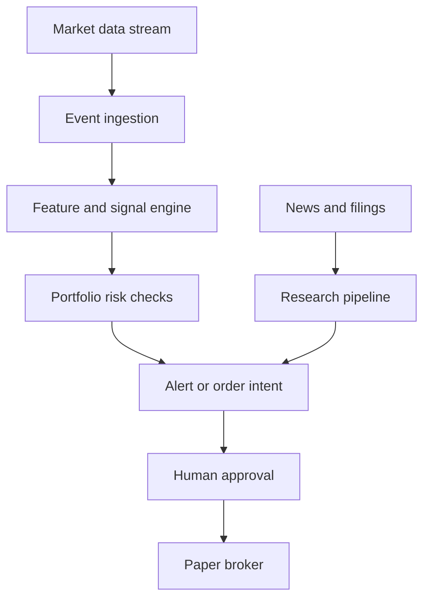

# Daily Trader

Daily Trader is a real-time portfolio monitoring and market decision-support application. It is intended to help an individual investor understand portfolio exposure, detect meaningful market trends, receive explainable alerts, and prepare trades for review.

The project begins as a monitoring and paper-trading system. Live automated execution is explicitly out of scope until the system has passed historical replay, out-of-sample testing, paper trading, shadow operation, and a controlled live rollout.

> [!WARNING]
> Daily Trader is experimental software, not financial advice. Trading involves risk. Do not connect it to a live brokerage account until its behavior and risk controls have been independently reviewed and validated.

## Phase 1 foundation

The repository is an npm-workspace TypeScript monorepo running on Node.js 22. Phase 1 provides framework shells, shared domain/configuration/observability packages, deterministic tests, local PostgreSQL/TimescaleDB and Redis services, and CI quality gates. It does **not** connect to market data or a broker, and execution is always disabled.

### Prerequisites

- Node.js 22.13 or newer, before Node.js 23 (`.nvmrc` pins the validated version)
- npm 11.18.0
- Docker with Compose v2 for local data services

Install exactly the locked dependency graph:

```bash
npm install --global npm@11.18.0
npm ci
```

### Repository structure

```text
apps/api/                 Fastify health API
apps/web/                 Next.js foundation status page
workers/market-data/      Observable worker shell; no provider connection
packages/domain/          Framework-free validated domain primitives
packages/config/          Environment validation and safe diagnostics
packages/observability/   Structured logs, metrics, traces, and redaction
packages/test-utils/      Deterministic test builders
infrastructure/           Local Compose services and operating notes
docs/adr/                 Accepted architecture decisions
user-stories/             Phase stories and implementation notes
```

### Quality and build commands

| Command                 | Purpose                                            |
| ----------------------- | -------------------------------------------------- |
| `npm run format`        | Format maintained files.                           |
| `npm run format:check`  | Verify formatting without writing files.           |
| `npm run lint`          | Run type-aware lint rules with zero warnings.      |
| `npm run lint:fix`      | Apply safe lint fixes, then enforce zero warnings. |
| `npm run typecheck`     | Strictly type-check every workspace.               |
| `npm test`              | Run deterministic unit tests once.                 |
| `npm run test:watch`    | Run unit tests in watch mode.                      |
| `npm run test:coverage` | Run tests and write diagnostic V8 coverage.        |
| `npm run build`         | Build shared packages, API, web app, and worker.   |
| `npm run ci`            | Reproduce the complete CI quality gate locally.    |

### Local services

Copy `.env.example` to `.env` only when local overrides are needed. Never commit `.env`.

```bash
npm run services:up
npm run services:check
npm run services:stop
```

`npm run services:down` removes containers and the Compose network but preserves named volumes. `npm run services:reset` is intentionally destructive: it also deletes local database and Redis volumes.

Run `npm run verify:foundation` for the complete Phase 1 check: CI-equivalent checks, local service startup/connectivity, and API/worker smoke checks. It stops the services in a cleanup step even when a later verification step fails.

### Run the process shells

```bash
npm run dev:api     # http://127.0.0.1:3001/health
npm run dev:web     # http://127.0.0.1:3000
npm run dev:worker  # health heartbeat only; no market feed
```

All health output identifies the environment as paper-only and order execution as disabled. No broker account, API key, or live market data is needed.

## Product principles

- **Decision support first.** The initial product informs and alerts; the user remains the decision-maker.
- **Deterministic fast path.** Market signals, portfolio calculations, risk checks, and order validation must use testable deterministic code.
- **AI outside the execution path.** AI may summarize filings and news, explain signals, and help maintain investment theses. It must not submit orders, bypass controls, or silently change strategy rules.
- **Explain every signal.** Alerts must include the observation, threshold, market-data timestamp, portfolio impact, and invalidation condition when applicable.
- **Fail safely.** Stale, missing, duplicated, or inconsistent data must prevent trade submission rather than trigger a best guess.
- **Preserve an audit trail.** Signals, decisions, order intents, approvals, broker responses, orders, and fills must be traceable.
- **Keep providers replaceable.** Market-data and brokerage integrations belong behind application-owned interfaces.

## Initial scope

The first release targets a personal portfolio of US-listed equities and ETFs. It aims for seconds-level responsiveness suitable for intraday monitoring, not exchange-colocated high-frequency trading.

### MVP capabilities

- Synchronize cash, positions, orders, and fills from a paper brokerage account.
- Stream and normalize real-time trades, quotes, and price bars.
- Display live portfolio value, unrealized profit and loss, allocation, concentration, and exposure.
- Maintain watchlists.
- Detect a small set of transparent, configurable market and portfolio signals.
- Send explainable real-time alerts.
- Replay recorded market events deterministically.
- Create an `OrderIntent` for user review without immediately placing an order.
- Submit approved order intents to a paper account.
- Record an immutable decision and execution history.

### Not in the MVP

- Unattended live trading
- High-frequency or latency-arbitrage strategies
- Options, futures, foreign exchange, or cryptocurrency trading
- Opaque machine-learning trading strategies
- Social-media sentiment trading
- Multi-user advisory or brokerage features
- AI-generated orders or AI overrides of risk controls

## System flow



Daily Trader has two processing paths:

1. **Fast path:** market events → normalized features → deterministic signals → portfolio risk checks → alerts or order intents.
2. **Research path:** filings, earnings, and news → asynchronous analysis → contextual information attached to alerts and investment theses.

The research path may enrich a decision, but it must never block or control the fast path.

## Proposed technology stack

The stack is provisional until the first architecture decision records are accepted.

| Area                           | Initial choice                                    |
| ------------------------------ | ------------------------------------------------- |
| Language                       | TypeScript                                        |
| Web application                | Next.js                                           |
| Backend API                    | Fastify                                           |
| Streaming workers              | Long-running Node.js processes                    |
| Primary database               | PostgreSQL with TimescaleDB                       |
| Event transport                | Redis Streams                                     |
| Client updates                 | WebSockets or server-sent events                  |
| Local environment              | Docker Compose                                    |
| Initial market data and broker | Alpaca paper environment behind provider adapters |
| Observability                  | OpenTelemetry with metrics, logs, and traces      |
| Initial cloud target           | AWS ECS/Fargate, RDS, and ElastiCache             |

Kafka or Redpanda should not be introduced until measured throughput or durability requirements justify the operational cost.

## Core domain concepts

The initial model is expected to include:

```text
Account
Portfolio
Position
Instrument
MarketEvent
PriceBar
SignalDefinition
SignalOccurrence
RiskRule
Alert
InvestmentThesis
OrderIntent
Order
Fill
DecisionLog
```

`OrderIntent` is deliberately separate from `Order`. An intent represents a proposed action before approval, final risk validation, and broker submission.

## Initial signals

The first signal engine should support a small set of configurable rules:

1. Unusual volume relative to the same time of day.
2. Breakout above or below a rolling price range.
3. Abnormal movement relative to recent volatility or ATR.
4. Relative strength or weakness against SPY and an appropriate sector ETF.
5. Portfolio-risk events such as excessive concentration or drawdown.

Signals are observations, not recommendations. Each occurrence must record enough information to reproduce and explain the result.

```ts
interface SignalOccurrence {
  instrument: InstrumentId;
  signalType: string;
  signalDefinitionVersion: string;
  observedAt: UtcTimestamp;
  marketDataTimestamp: UtcTimestamp;
  value: ExactDecimal;
  threshold: ExactDecimal;
  units: string;
  reason: string;
  portfolioImpact?: string;
  invalidationCondition?: string;
}
```

## Risk controls

Paper execution must not be implemented without:

- A global kill switch
- Maximum order-notional and quantity limits
- Maximum position and concentration limits
- Maximum daily-loss limits
- Maximum open-order limits
- Market-hours restrictions
- Quote-age and data-staleness checks
- Bid/ask spread and liquidity checks
- Idempotency keys for order submission
- Duplicate-event and duplicate-order protection
- Reconciliation of broker orders, fills, cash, and positions
- An append-only decision and execution log

Risk checks must run again immediately before broker submission. A provider timeout, uncertain order state, stale quote, or failed reconciliation must halt new submissions and raise an operational alert.

## Performance objectives

These are initial service-level objectives measured from the time Daily Trader receives an event; upstream provider latency is tracked separately.

| Operation                          | Initial objective   |
| ---------------------------------- | ------------------- |
| Feature update                     | p95 under 250 ms    |
| Signal and risk evaluation         | p95 under 250 ms    |
| Alert dispatch                     | p95 under 2 seconds |
| End-to-end alert generation        | p95 under 5 seconds |
| Duplicate order intents            | Zero                |
| Unexplained broker/portfolio drift | Zero tolerated      |

Performance work should be driven by measurements. Correctness, reproducibility, and safe failure take priority over lower latency.

## Delivery roadmap

### Phase 0: Definition

- Confirm asset universe, market hours, broker, data provider, and responsiveness target.
- Define portfolio and trading constraints.
- Record architecture and provider decisions as ADRs.
- Define strategy evaluation and paper-trading acceptance criteria.

### Phase 1: Foundation

- Create the TypeScript monorepo and shared domain package.
- Add formatting, linting, type checking, tests, and continuous integration.
- Add local PostgreSQL and Redis services.
- Establish configuration, secrets, logging, metrics, and tracing conventions.

### Phase 2: Market-data ingestion

- Connect to a real-time paper-market feed.
- Normalize provider events into application-owned schemas.
- Handle authentication, heartbeats, disconnects, reconnects, and sequence gaps.
- Persist bars and record an event stream that can be replayed.
- Surface connection health and data freshness.

### Phase 3: Portfolio monitoring

- Synchronize the paper account, positions, cash, orders, and fills.
- Reconcile local and broker state.
- Calculate profit and loss, allocation, concentration, and exposure.
- Deliver the first live portfolio dashboard.

### Phase 4: Signal engine

- Implement versioned signal definitions.
- Add the initial five deterministic signal types.
- Attach evidence, timestamps, portfolio context, and invalidation conditions.
- Verify that recorded sessions reproduce identical results.

### Phase 5: Alerts and decision workflow

- Deliver alerts to the dashboard and one external notification channel.
- Add acknowledgement, snooze, dismissal, and escalation states.
- Introduce order intents with an explicit review step.
- Keep all execution disabled.

### Phase 6: Backtesting and strategy evaluation

- Replay historical data through the production signal interfaces.
- Model spreads, fees, slippage, partial fills, and rejected orders.
- Guard against look-ahead and survivorship bias.
- Add out-of-sample and walk-forward evaluation.
- Compare strategies with suitable benchmarks.

### Phase 7: Paper execution

- Add approval and final risk-validation workflows.
- Submit approved intents to the paper broker.
- Track order state, partial fills, cancellations, and reconciliation.
- Exercise the kill switch and failure-recovery procedures.

### Phase 8: Hardening

- Run continuously in paper and shadow modes.
- Add provider failure, disconnect, stale-data, and duplicate-event tests.
- Define operational dashboards, alerts, runbooks, and recovery objectives.
- Perform a security and risk-control review.

### Phase 9: Controlled live rollout

This phase requires a separate explicit decision. Begin with minimal capital, narrow strategy permissions, hard limits, human approval, and immediate rollback capability. Increase scope only from measured evidence.

## First vertical slice

The first implementation milestone is intentionally narrow:

1. Stream live AAPL and SPY market data into a terminal worker.
2. Normalize and store one-minute bars.
3. Display the latest price, timestamp, and connection health.
4. Detect one configurable breakout-plus-volume signal.
5. Persist the evidence used to create that signal.
6. Replay the recorded session and reproduce the result exactly.

Only after this slice works should the project add broker synchronization and portfolio-aware alerts.

## Testing strategy

- Unit-test financial calculations, signal rules, risk rules, and time-boundary behavior.
- Contract-test every external provider adapter using sanitized fixtures.
- Integration-test database, event-stream, reconnection, and idempotency behavior.
- Replay recorded sessions to test determinism and regressions.
- Property-test invariants such as nonnegative quantities and bounded risk limits where useful.
- Inject provider disconnects, duplicates, out-of-order events, and stale quotes.
- Keep live-broker credentials out of all automated test environments.

Strategy success is not measured only by profit and loss. Track latency, data gaps, alert precision, drawdown, turnover, exposure, slippage, rejected orders, reconciliation drift, and operator interventions.

## Repository status

Phase 1 establishes and validates the development foundation. The next implementation phase connects a paper-compatible AAPL and SPY market feed behind an application-owned adapter, normalizes events, persists one-minute bars, and proves deterministic replay. See [AGENTS.md](./AGENTS.md), the [architecture decisions](./docs/adr/README.md), and the [Phase 1 implementation notes](./user-stories/notes/README.md) before extending the system.

## External documentation

- [Alpaca Market Data API](https://docs.alpaca.markets/us/docs/about-market-data-api)
- [Alpaca streaming market data](https://docs.alpaca.markets/us/docs/streaming-market-data)
- [Alpaca paper trading](https://docs.alpaca.markets/us/docs/paper-trading)
- [Massive stock WebSocket feeds](https://massive.com/docs/websocket/stocks/overview)
- [SEC EDGAR APIs](https://www.sec.gov/search-filings/edgar-application-programming-interfaces)
